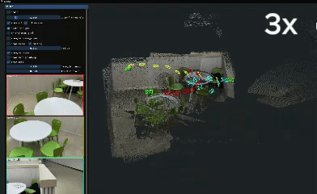

[comment]: <> (# Cognitive-Unburdening Surveillance with Free Viewpoint)

<p align="center">
  <h1 align="center">Cognitive-Unburdening Surveillance with Free Viewpoint</h1>
  <!-- <p align="center">
    <a href=""><strong></strong></a>
    ·
    <a href=""><strong></strong></a>
    ·
    <a href=""><strong></strong></a>
  </p>
  <p align="center">(* Equal Contribution)</p> -->

<!-- [comment]: <> (  <h2 align="center">PAPER</h2>)
  <h3 align="center"><a href="">Paper</a> | <a href="">Video</a> | <a href="">Project Page</a></h3>
  <div align="center"></div> -->

<p align="center">
    
</p>
<br>

# Getting Started
## Installation
```
conda create -n multicam-mast3r-slam python=3.11
conda activate multicam-mast3r-slam
```
Check the system's CUDA version with nvcc
```
nvcc --version
```
Install pytorch with **matching** CUDA version following:
```
# CUDA 11.8
conda install pytorch==2.5.1 torchvision==0.20.1 torchaudio==2.5.1  pytorch-cuda=11.8 -c pytorch -c nvidia
# CUDA 12.1
conda install pytorch==2.5.1 torchvision==0.20.1 torchaudio==2.5.1 pytorch-cuda=12.1 -c pytorch -c nvidia
# CUDA 12.4
conda install pytorch==2.5.1 torchvision==0.20.1 torchaudio==2.5.1 pytorch-cuda=12.4 -c pytorch -c nvidia
```

Clone the repo and install the dependencies.
```
git clone https://github.com/rmurai0610/MASt3R-SLAM.git --recursive
cd MASt3R-SLAM/

# if you've clone the repo without --recursive run
# git submodule update --init --recursive

pip install -e thirdparty/mast3r
pip install -e thirdparty/in3d
pip install --no-build-isolation -e .
 
```

Setup the checkpoints for MASt3R and retrieval.  The license for the checkpoints and more information on the datasets used is written [here](https://github.com/naver/mast3r/blob/mast3r_sfm/CHECKPOINTS_NOTICE).
```
mkdir -p checkpoints/
wget https://download.europe.naverlabs.com/ComputerVision/MASt3R/MASt3R_ViTLarge_BaseDecoder_512_catmlpdpt_metric.pth -P checkpoints/
wget https://download.europe.naverlabs.com/ComputerVision/MASt3R/MASt3R_ViTLarge_BaseDecoder_512_catmlpdpt_metric_retrieval_trainingfree.pth -P checkpoints/
wget https://download.europe.naverlabs.com/ComputerVision/MASt3R/MASt3R_ViTLarge_BaseDecoder_512_catmlpdpt_metric_retrieval_codebook.pkl -P checkpoints/
```


## Examples

## Live Demo
Connect a realsense camera to the PC and run
```
python main.py --dataset realsense --config config/base.yaml

```
## Running on a multicam (iPhone, Android, Drones, etc..)
You would need to edit config/multicam.yaml.
For any additional camera input, add the following under `dataset:`

```
- id: "iphone"
  type: "iphone"
  path: "your/ip/path"
  camera_id: n
```

For iPhone camera input, download Droid Cam from the App Store then input the IP address displayed from that app.
For Android camera input, download IP Webcam then input the IP address displayed from that app.
For a DJI drone camera input, 

```
python main.py --config config/multicam.yaml
```

If the calibration parameters are known, you can specify them in intrinsics.yaml
```
python main.py --config config/multicam.yaml --calib config/intrinsics.yaml
```

## Downloading a Munji Dataset
```
bash ./scripts/download_munji.sh
```


## Running on Munji Multi-cam benchmark dataset
```
chmod +x scripts/download_munji.sh && ./scripts/download_munji.sh
python main.py --config config/multicam_munji_tables.yaml
```


## Reproducibility
There might be minor differences between the released version and the results in the paper after developing this multi-processing version. 
We run all our experiments on an RTX 3090, and the performance may differ when running with a different GPU.

## Acknowledgement
We sincerely thank the developers and contributors of the many open-source projects that our code is built upon.
- [MASt3R-SLAM](https://github.com/rmurai0610/MASt3R-SLAM)
- [MASt3R](https://github.com/naver/mast3r)
- [MASt3R-SfM](https://github.com/naver/mast3r/tree/mast3r_sfm)
- [DROID-SLAM](https://github.com/princeton-vl/DROID-SLAM)
- [ModernGL](https://github.com/moderngl/moderngl)

# Citation
If you found this code/work to be useful in your own research, please considering citing the following:
